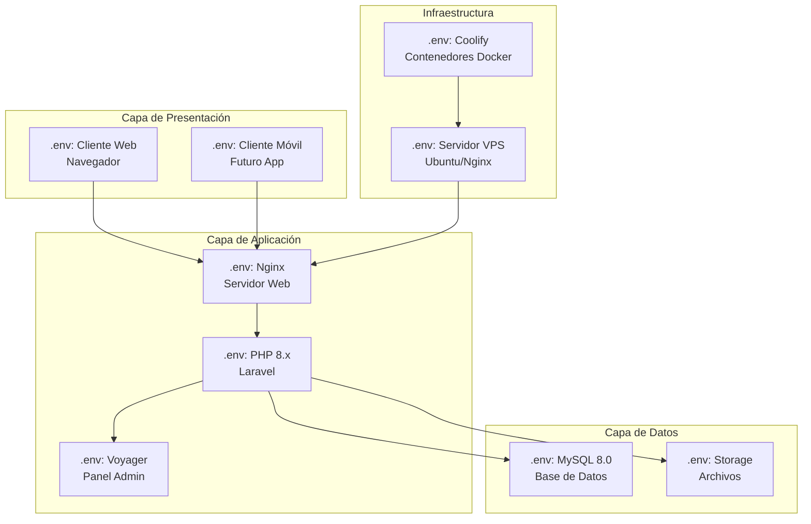
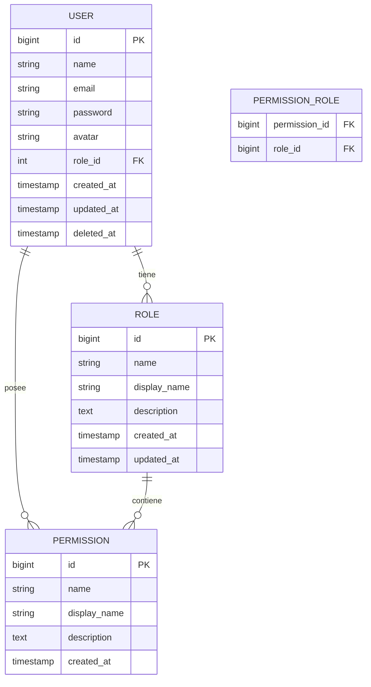
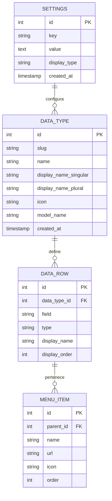
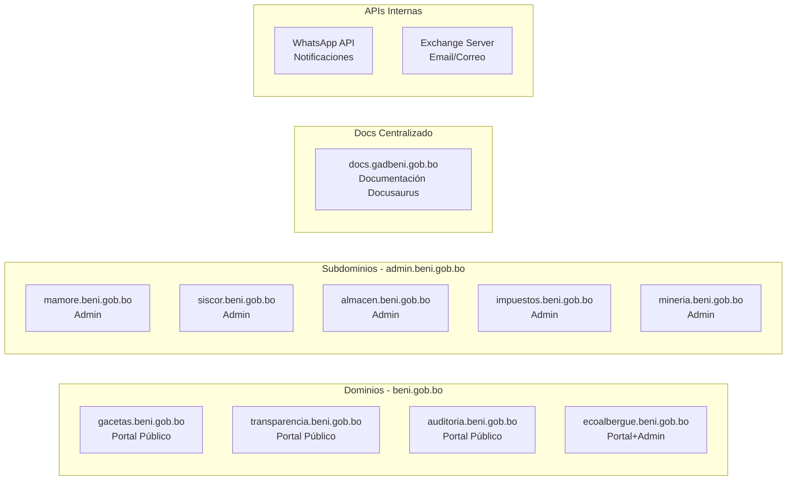
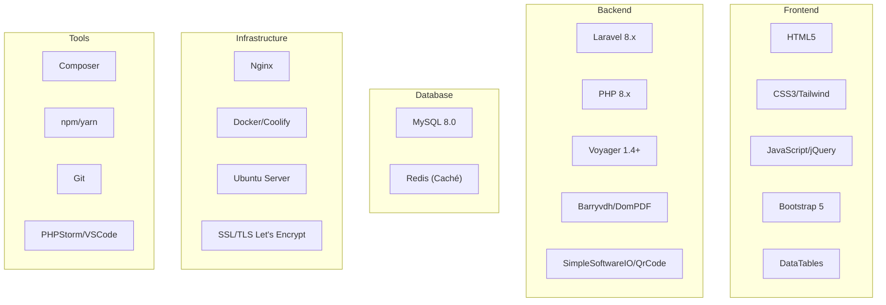
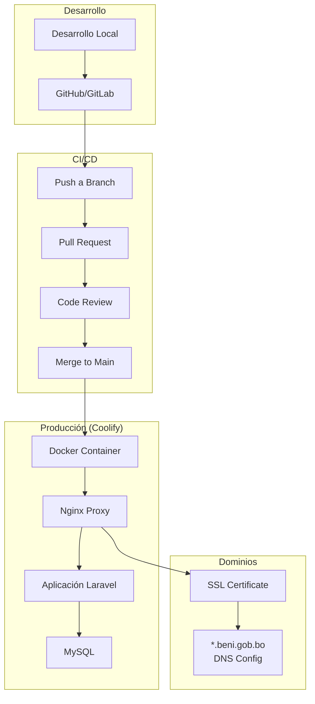
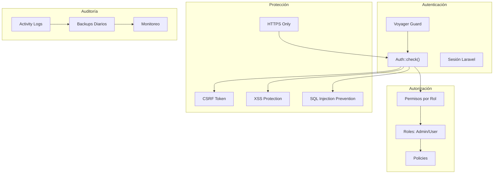

# Arquitectura de Sistemas - G.A.D. Beni

## Visión General de la Infraestructura

Todos los sistemas del Gobierno Autónomo Departamental del Beni comparten una **arquitectura común basada en Laravel + Voyager**, lo que permite:

*   Consistencia en la gestión de usuarios y permisos
*   Reutilización de componentes y patrones
*   Mantenimiento centralizado
*   Escalabilidad modular

---

## Arquitectura Técnica Común



---

## Modelos de Datos Comunes

### Sistema de Autenticación (Compartido)



### Sistema de Settings (Voyager)



---

## Diagrama de Red y URLs



---

## Catálogo de Sistemas

| Sistema | Tipo | Stack | Base de Datos | Puerto |
|---------|------|-------|---------------|--------|
| MAMORÉ | Admin | Laravel 8 + Voyager | MySQL | 443 |
| SISCOR | Admin | Laravel 8 + Voyager | MySQL | 443 |
| ALMACÉN | Admin | Laravel 8 + Voyager | MySQL | 443 |
| IMPUESTOS | Admin | Laravel 8 + Voyager | MySQL | 443 |
| MINERÍA | Admin | Laravel 8 + Voyager | MySQL | 443 |
| GACETAS | Portal | Laravel 8 + Voyager | MySQL | 80 |
| TRANSPARENCIA | Portal | Laravel 8 + Voyager | MySQL | 80 |
| AUDITORÍA | Portal | Laravel 8 + Voyager | MySQL | 80 |
| ECOALBERGUE | Mixto | Laravel 8 + Voyager | MySQL | 443 |
| DOCUMENTACIÓN | Docs | Docusaurus | - | 3000 |

---

## Tecnologías por Capa



---

## Modelo de Despliegue (Coolify)



---

## Seguridad



---

## Estructura de Directorios Común

```
proygobe/
├── mamore/           # Sistema MAMORÉ
│   ├── app/
│   │   ├── Http/Controllers/
│   │   ├── Models/
│   │   └── Providers/
│   ├── database/
│   │   ├── migrations/
│   │   └── seeders/
│   ├── resources/
│   │   ├── views/
│   │   └── lang/
│   └── routes/
│
├── siscor/           # Sistema SISCOR
├── almacen/          # Sistema ALMACÉN
├── impuestos/       # Sistema IMPUESTOS
├── mineria/          # Sistema MINERÍA
├── gacetas/          # Portal GACETAS
├── transparencia/    # Portal TRANSPARENCIA
├── auditoria/        # Portal AUDITORÍA
└── plantilla-ecoalbergue/  # Sistema ECOALBERGUE
```

---

## Características Compartidas

### Voyager BREAD

Todos los sistemas usan Voyager para CRUD:

| Operación | Método | Descripción |
|----------|--------|-------------|
| **B**rowse | GET | Listar registros |
| **R**ead | GET | Ver detalle |
| **E**dit | GET/POST | Editar registro |
| **A**dd | GET/POST | Crear nuevo |
| **D**elete | DELETE | Eliminar registro |

### Modelo de SoftDeletes

```php
// Todos los modelos principales usan SoftDeletes
class Modelo extends Model
{
    use SoftDeletes;
    protected $dates = ['deleted_at'];
}
```

### Timestamps Automáticos

```php
// Created_at y updated_at gestionados por Laravel
// deleted_at para eliminación lógica
```

---

## Métricas de Infraestructura

| Métrica | Valor |
|---------|-------|
| Total Sistemas | 9 |
| Bases de Datos | 9 (1 por sistema) |
| Dominios | 10+ |
| Contenedores | ~15 (prod + dev) |
| Backups | Diarios automáticos |
| Uptime Target | 99.5% |

---

## Futuras Mejoras

*   **API REST:** Endpoints centralizados para apps móviles
*   **Microservicios:** Descomposición de sistemas monolithicos
*   **CDN:** Distribución de assets estáticos
*   **Monitoreo:** Dashboard Grafana + Prometheus
*   **Logging Centralizado:** ELK Stack