# Diagramas de Flujo - Sistemas G.A.D. Beni

Esta sección contiene los diagramas de flujo que ilustran los procesos principales de cada sistema.

---

## MAMORÉ - Flujo de Contrataciones

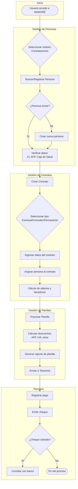

---

## SISCOR - Flujo de Correspondencia

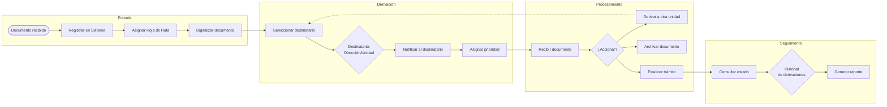

---

## ALMACÉN - Flujo de Inventario

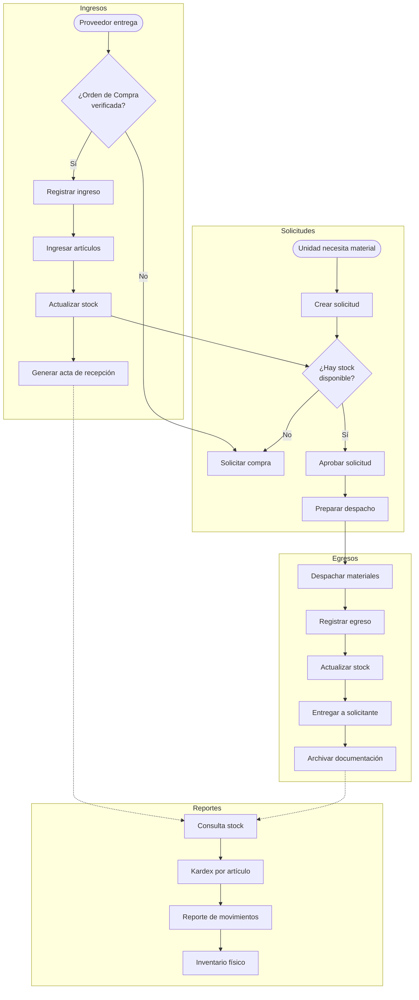

---

## MINERÍA - Flujo de Certificados

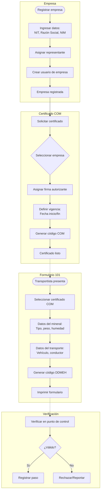

---

## GACETAS - Flujo de Publicación

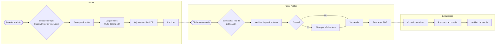

---

## TRANSPARENCIA - Flujo de Denuncias

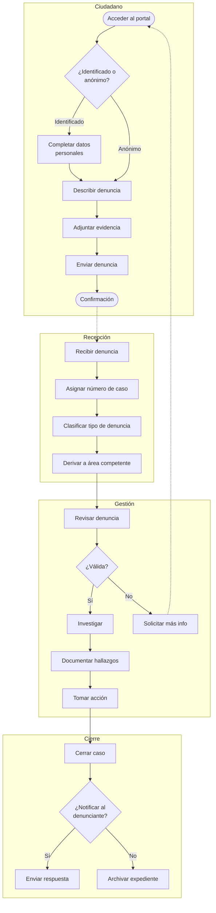

---

## AUDITORÍA - Flujo de Informes

```mermaid
flowchart LR
    subgraph "Gestión de Informes"
        AI1([Acceder al Admin])
        AI2[Crear nuevo informe]
        AI3[Cargar datos:<br/>Título, descripción]
        AI4[Adjuntar PDF]
        AI5[Definir fecha de publicación]
        AI6[Publicar informe]
    end

    subgraph "Portal Público"
        AP1([Ciudadano accede])
        AP2{Seleccionar año<br/>de gestión}
        AP3[Ver lista de informes]
        AP4{¿Buscar?}
        AP5[Filtrar por palabras]
        AP6[Ver informe]
        AP7[Descargar PDF]
    end

    subgraph "Organización"
        ORG1[Agrupar por año]
        ORG2[Ordenar por fecha]
        ORG3[Marcar destacados]
        ORG4[Actualizar anualmente]
    end

    AI1 --> AI2 --> AI3 --> AI4 --> AI5 --> AI6
    AI6 -.-> ORG1 --> ORG2 --> ORG3 --> ORG4
    ORG4 -.-> AP1
    AP1 --> AP2 --> AP3
    AP3 --> AP4
    AP4 -->|Sí| AP5
    AP4 -->|No| AP6
    AP5 --> AP6
    AP6 --> AP7
```

---

## ECOALBERGUE - Flujo de Reservas

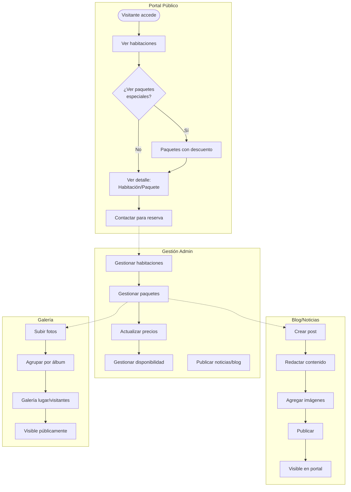

---

## IMPUESTOS - Flujo de Tramitación

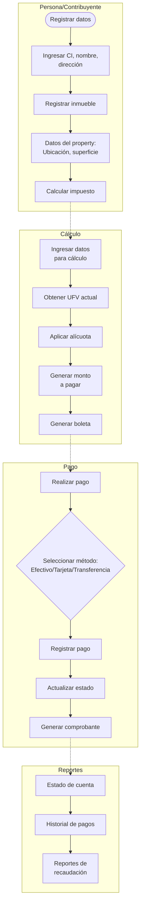

---

## Resumen de Modelos de Datos Principales

### MAMORÉ - Modelo de Personas y Contratos

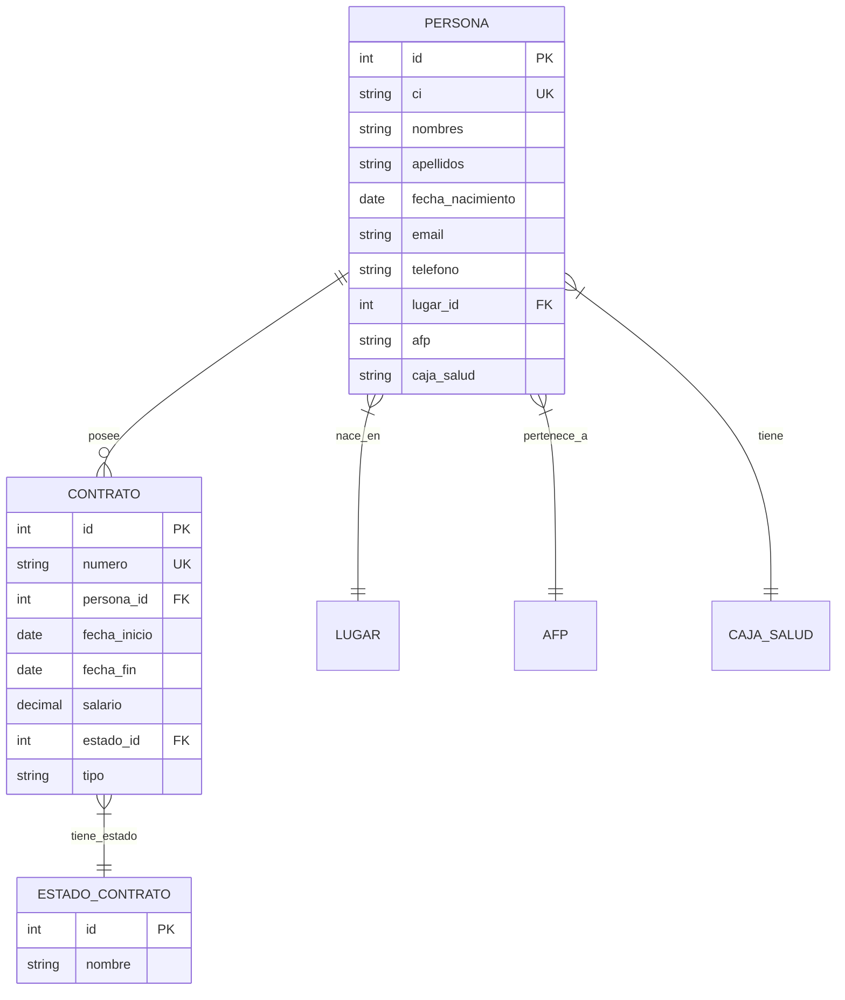

---

### MINERÍA - Modelo de Certificados y Formularios

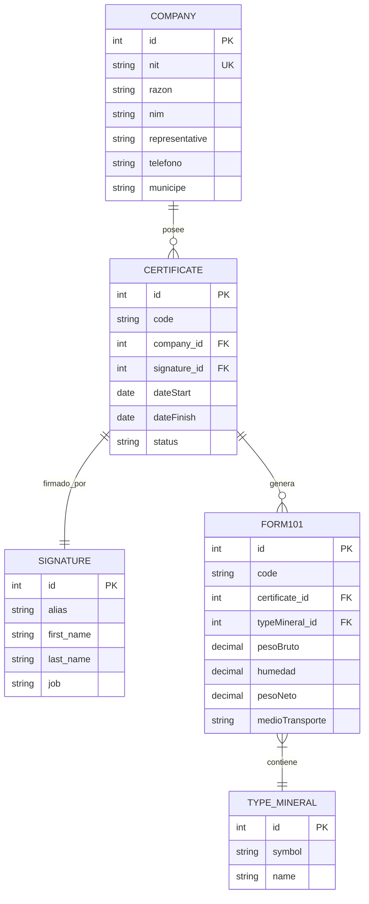

---

### ALMACÉN - Modelo de Inventario

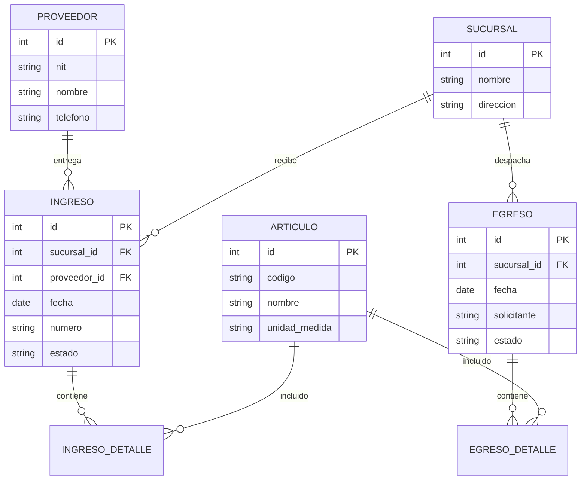