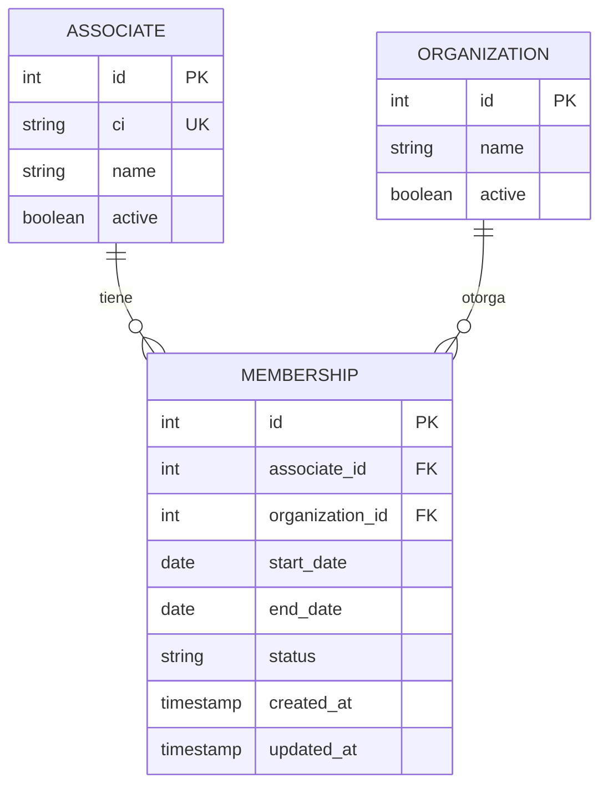

# Gestión de Membresías

## Descripción General

Este módulo permite administrar las **membresías** de los asociados a las organizaciones de transporte. Cada membresía tiene un período de vigencia determinado.

## Modelo de Datos



## Campos de la Membresía

| Campo             | Tipo      | Descripción                                        |
| :---------------- | :-------- | :------------------------------------------------- |
| id                | INTEGER   | Identificador único                               |
| associate_id      | INTEGER   | Asociado                                           |
| organization_id   | INTEGER   | Organización                                      |
| start_date        | DATE      | Fecha de inicio                                   |
| end_date          | DATE      | Fecha de vencimiento                              |
| status            | STRING    | Estado de la membresía                            |
| created_at        | TIMESTAMP | Fecha de creación                                 |
| updated_at        | TIMESTAMP | Fecha de última actualización                      |

## Flujo de Gestión

### 1. Registrar Membresía

```php
// En MembershipController
public function store(Request $request, Associate $associate)
{
    Membership::create([
        'associate_id' => $associate->id,
        'organization_id' => $request->organization_id,
        'start_date' => $request->start_date,
        'end_date' => $request->end_date,
        'status' => 'active'
    ]);
    
    return redirect()->back()->with('success', 'Membresía creada');
}
```

### 2. Validar Vigencia

El sistema verifica automáticamente si la membresía está vigente:

```php
// En AssociateController
if (!$associate->active) {
    $error = 'El asociado no se encuentra activo';
    return view('search', ['associate' => $associate, 'error' => $error]);
}
```

## Estados de la Membresía

| Estado          | Descripción                                                    |
| :-------------- | :-------------------------------------------------------------- |
| **Vigente**      | Dentro del período de validez                                   |
| **Vencido**      | Pasada la fecha de vencimiento                                  |
| **Cancelado**    | Cancelada manualmente                                           |
| **Suspendido**   | Suspendida temporalmente                                         |

## Cálculo de Vigencia

```php
// Verificar si la membresía está vigente
$today = Carbon::now();
$isValid = $membership->end_date >= $today && 
           $membership->start_date <= $today && 
           $membership->status == 'active';
```

## Ejemplo de Registro

```
Membresía #123
  Asociado: Juan Pérez López
  Organización: Asociación de Transportistas del Beni
  Fecha Inicio: 01/01/2024
  Fecha Fin: 31/12/2024
  Estado: Vigente
```

## Panel Admin

### Gestión de Membresías

*   **Crear:** Associate > Membership > Create
*   **Editar:** Modificar fechas y estado
*   **Cancelar:** Cambiar estado a cancelado
*   **Historial:** Ver todas las membresías de un asociado