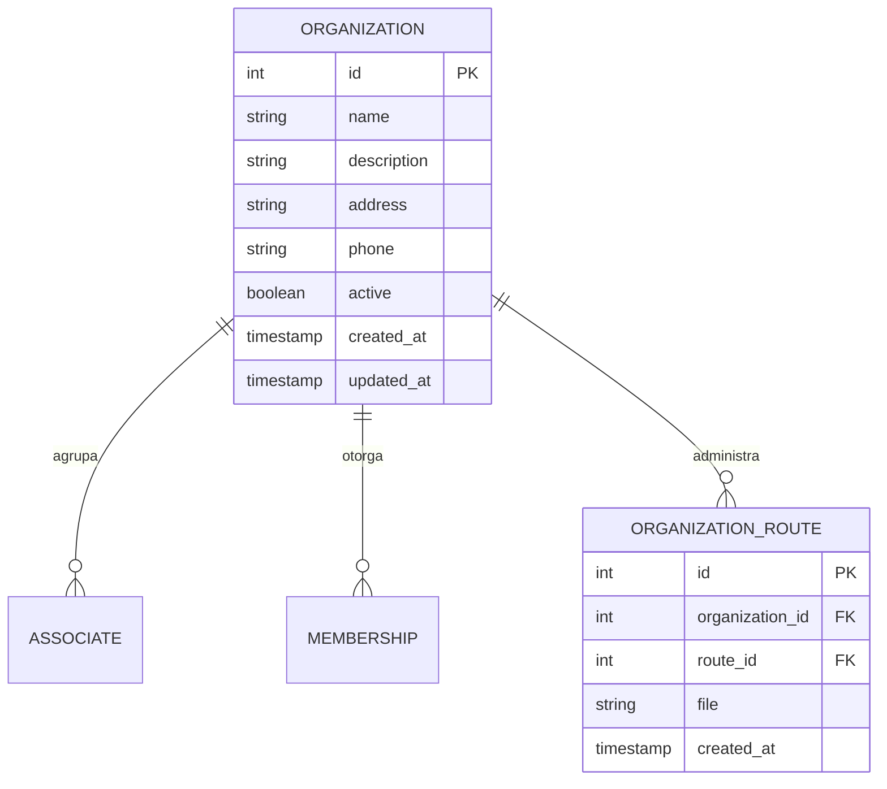

# Gestión de Organizaciones

## Descripción General

Este módulo permite administrar las **organizaciones de transporte** (asociaciones) registradas en el sistema. Cada organización agrupa a múltiples asociados y gestiona sus rutas.

## Modelo de Datos



## Campos de la Organización

| Campo             | Tipo      | Descripción                                        |
| :---------------- | :-------- | :------------------------------------------------- |
| id                | INTEGER   | Identificador único                               |
| name              | STRING    | Nombre de la organización                         |
| description       | TEXT      | Descripción                                       |
| address           | STRING    | Dirección                                         |
| phone             | STRING    | Teléfono de contacto                              |
| active            | BOOLEAN   | Estado activo/inactivo                            |
| created_at        | TIMESTAMP | Fecha de creación                                 |
| updated_at        | TIMESTAMP | Fecha de última actualización                      |

## Funcionalidades de Gestión

### Toggle Activo/Inactivo

```php
// En organizationsController
public function toggleActive(Organization $organization)
{
    $organization->update(['active' => !$organization->active]);
    return redirect()->back();
}
```

### Gesti��n de Rutas por Organización

| Acción | Ruta | Método |
|--------|------|--------|
| Ver rutas | `admin/organizations/{id}/routes/edit` | GET |
| Actualizar | `admin/organizations/{id}/routes/update` | PUT |
| Eliminar | `admin/organizations/{id}/routes/{route}` | DELETE |
| Descargar | `admin/organizations/{id}/routes/{route}/download` | GET |

## Estados de la Organización

| Estado       | Descripción                                                    |
| :----------- | :-------------------------------------------------------------- |
| **Activa**    | Organización en funcionamiento                                 |
| **Inactiva** | Organización suspendida temporalmente                          |

## Relación con Otros Modelos

```
ORGANIZACIÓN
├── ASOCIADOS (1:N)
│   └── Juan Pérez
│   └── María García
├── MEMBRESÍAS (1:N)
│   └── Membresía #1 - Juan Pérez
│   └── Membresía #2 - María García
└── RUTAS (N:N)
    └── Ruta Trinidad-San Ignacio
    └── Ruta Trinidad-Santa Rosa
```

## Ejemplo de Organización

```
Organización: Asociación de Transportistas del Beni
  Descripción: Asociación departamental de transporte público
  Dirección: Av. 6 de Agosto #123, Trinidad
  Teléfono: 71123456
  Estado: Activa
  Total Asociados: 45
  Total Rutas: 12
```