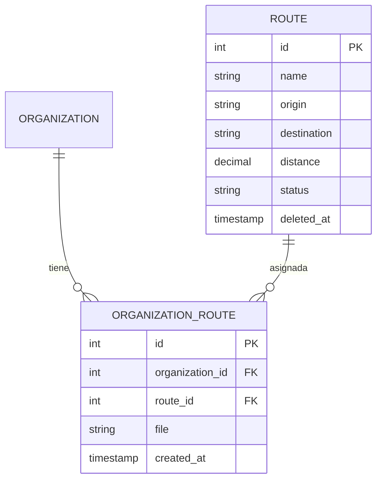

# Gestión de Rutas de Transporte

## Descripción General

Este módulo permite administrar las **rutas de transporte** registradas en el sistema. Cada ruta define un recorrido específico con origen, destino y distancia.

## Modelo de Datos



## Campos de la Ruta

| Campo             | Tipo      | Descripción                                        |
| :---------------- | :-------- | :------------------------------------------------- |
| id                | INTEGER   | Identificador único                               |
| name              | STRING    | Nombre de la ruta                                 |
| origin            | STRING    | Punto de origen                                   |
| destination       | STRING    | Punto de destino                                  |
| distance          | DECIMAL   | Distancia en kilómetros                           |
| status            | STRING    | Estado de la ruta                                 |
| deleted_at        | TIMESTAMP | Eliminación lógica                                |

## Flujo de Gestión

### 1. Crear Nueva Ruta

1.  **Acceder al Admin:** Voyager > Routes > Add New.
2.  **Completar Datos:**
    *   Nombre de la ruta.
    *   Origen.
    *   Destino.
    *   Distancia.
3.  **Guardar:** La ruta queda disponible.

### 2. Asignar Ruta a Organización

Cada organización puede tener múltiples rutas asignadas:

```php
// En OrganizationRouteController
public function edit($organization){
    $organization->load('routes');
    return view('organizations.routes.edit', compact('organization'));
}
```

### 3. Gestión de Archivos

Las rutas pueden tener documentos adjuntos:

| Acción | Ruta | Método |
|--------|------|--------|
| Editar rutas | `admin/organizations/{id}/routes/edit` | GET |
| Actualizar | `admin/organizations/{id}/routes/update` | PUT |
| Eliminar | `admin/organizations/{id}/routes/{route}` | DELETE |
| Descargar | `admin/organizations/{id}/routes/{route}/download` | GET |

## Estados de la Ruta

| Estado       | Descripción                                                    |
| :----------- | :-------------------------------------------------------------- |
| **Activa**    | Ruta en operación                                              |
| **Inactiva**  | Ruta suspendida temporalmente                                  |
| **Cancelada** | Ruta cancelada                                                  |

## Ejemplo de Rutas Comunes

```
Ruta: Trinidad - San Ignacio
  Origen: Trinidad
  Destino: San Ignacio de Mojos
  Distancia: 65 km

Ruta: Trinidad - Santa Rosa
  Origen: Trinidad
  Destino: Santa Rosa de Yacuma
  Distancia: 48 km
```