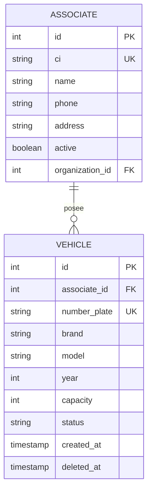

# Gestión de Vehículos

## Descripción General

Este módulo permite administrar los **vehículos de transporte** registrados en el sistema. Cada vehículo está vinculado a un asociado propietario y tiene características específicas.

## Modelo de Datos



## Campos del Vehículo

| Campo             | Tipo      | Descripción                                        |
| :---------------- | :-------- | :------------------------------------------------- |
| id                | INTEGER   | Identificador único                               |
| associate_id      | INTEGER   | Propietario del vehículo                          |
| number_plate      | STRING    | Placa vehicular (única)                           |
| brand             | STRING    | Marca del vehículo                                |
| model             | STRING    | Modelo                                            |
| year              | YEAR      | Año del vehículo                                  |
| capacity          | INTEGER   | Capacidad de pasajeros                            |
| status            | STRING    | Estado del vehículo                               |
| created_at        | TIMESTAMP | Fecha de creación                                 |
| deleted_at        | TIMESTAMP | Eliminación lógica                                |

## Flujo de Gestión

### 1. Registrar Vehículo

1.  **Acceder al Admin:** Voyager > Vehicles > Add New.
2.  **Completar Datos:**
    *   Seleccionar asociado propietario.
    *   Ingresar número de placa.
    *   Marca y modelo.
    *   Año de fabricación.
    *   Capacidad de pasajeros.
3.  **Guardar:** El vehículo queda vinculado al asociado.

### 2. Validación de Placa

El sistema valida que no existan placas duplicadas:

```php
// Búsqueda por placa en HomeController
$vehicle = Vehicle::where('number_plate', $request->search)->first();
```

### 3. Búsqueda por Placa

Los ciudadanos pueden buscar información por número de placa:

1.  **Ingresar placa:** En el campo de búsqueda del portal.
2.  **Resultado:** Muestra datos del propietario y vehículo.

## Estados del Vehículo

| Estado       | Descripción                                                    |
| :----------- | :-------------------------------------------------------------- |
| **Activo**    | Vehículo operativo                                             |
| **Inactivo**  | Vehículo fuera de servicio                                     |
| **En Mantenimiento** | Vehículo en reparación                         |

## Relación con Asociados

```
┌─────────────────────────────────────────────────────┐
│  ASOCIADO: Juan Pérez López                         │
│  CI: 1234567                                        │
│  ─────────────────────────────────────────────────  │
│  VEHÍCULOS:                                         │
│  ┌─────────────────────────────────────────────┐  │
│  │ Placa: ABC-123                              │  │
│  │ Marca: Toyota | Modelo: Coaster            │  │
│  │ Año: 2020 | Capacidad: 30 pasajeros        │  │
│  └─────────────────────────────────────────────┘  │
│  ┌─────────────────────────────────────────────┐  │
│  │ Placa: DEF-456                              │  │
│  │ Marca: Mitsubishi | Modelo: Rosa            │  │
│  │ Año: 2018 | Capacidad: 25 pasajeros         │  │
│  └─────────────────────────────────────────────┘  │
└─────────────────────────────────────────────────────┘
```

## Ejemplo de Datos

| Campo             | Ejemplo                                         |
| :---------------- | :---------------------------------------------- |
| number_plate      | ABC-123                                        |
| brand             | Toyota                                         |
| model             | Coaster                                        |
| year              | 2020                                           |
| capacity          | 30                                             |